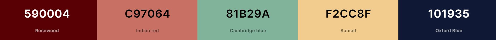

# Teacher Resource Hub

The Teacher Resource Hub is a website designed for teachers to collaborate with each other by sharing lesson resources with each other. Users will be able to share their own designs and download resources from others.

The site is live, the link to this is found [HERE](https://sarah2244-4.github.io/project-3-teacher-resource-hub/).

## Contents

- [User Experience (UX)](#user-experience-ux)
  - [Goals](#goals)
  - [Users](#users)
  - [New User Stories](#new-user-stories)
  - [Existing User Stories](#existing-user-stories)
- [Design](#design)
  - [Wireframes](#wireframes)
  - [Colour Scheme](#colour-scheme)
  - [Typography](#typography)
  - [Effects](#effects)
  - [Design Choices](#design-choices)
- [Features](#features)
  - [Existing Features](#existing-features)
    - [Home Page](#home-page)
    - [Sign Up](#sign-up)
    - [Login](#login)
    - [Profile](#profile)
    - [Edit Profile](#edit-profile)
    - [Add Resource](#add-resource)
    - [Edit Resource](#edit-resource)
    - [Delete Modal](#delete-modal)
    - [Subject Pages](#subject-pages)
    - [Comments](#comments)
    - [Logout](#logout)
    - [404 Page](#404-page)
  - [Future Features](#future-features)
- [Testing](#testing)
  - [Manual Testing](#manual-testing)
    - [Responsivity](#responsivity)
    - [Browser Compatibility](#browser-compatibility)
    - [Functionality and Usability](#functionality-and-usability)
  - [Testing User Stories](#testing-user-stories)
    - [New Users](#new-users)
    - [Existing Users](#existing-users)
  - [Bugs](#bugs)
    - [Resolved Bugs](#resolved-bugs)
    - [Unresolved Bugs](#unresolved-bugs)
- [HTML and CSS Validation](#html-and-css-validation)
- [JS Validation](#js-validation)
- [Lighthouse Testing](#lighthouse-testing)
- [Technologies Used](#technologies-used)
  - [Main Languages](#main-languages)
  - [Frameworks, Libraries and Programs](#frameworks-libraries-and-programs)
- [Deployment](#deployment)
  - [GitHub Pages](#github-pages)
  - [Local Source Files](#local-source-files)
- [Credits](#credits)
  - [Content](#content)
  - [Images](#images)
  - [Acknowledgements](#acknowledgements)

## User Experience (UX)

### Goals

The aim of the site is to allow users to collaborate with each other by uploading and downloading resource and sharing opinions on them. 

Users want to be able to intuitively navigate the site and receive immediate feedback when they interact.

### Users

Users will be educators looking for help with their lesson planning. They may also be looking to share their lesson resources. 

### New User Stories

As a first time user of the site I want to be able to:
- Find out what the website is for
- Easily and intuitively navigate without using browser buttons
- View resources before signing up 
- Sign up if I don't have an account
- Upload my resources
- View my uploaded resources
- View other people's resources
- Download resources to use
- Let other users know what I thought of the resources I downloaded
- View resources by subject or education level
- Logout 

### Existing User Stories

As an existing user I want to be able to:
- Login to my account
- Edit my uploaded resources
- Delete my uploaded resources
- Find out what others think of my resources 
- View other people's resources
- Download resources to use
- View resources by subject or education level
- Logout 
- Edit my user details
- Delete my account 

## Design

### Wireframes

| Home Page | Sign Up | Profile | Subjects Pages |
| :---: | :---: | :---: | :---: |
| [Mobile](assets/images/wireframes/mobile-start.jpg) | [Mobile](assets/images/wireframes/mobile-game.jpg) | [Mobile](assets/images/wireframes/mobile-result.jpg) |
| [Tablet](assets/images/wireframes/tablet-start.jpg) | [Tablet](assets/images/wireframes/tablet-game.jpg) |[Tablet](assets/images/wireframes/tablet-result.jpg)|
| [Desktop](assets/images/wireframes/desktop-start.jpg) | [Desktop](assets/images/wireframes/desktop-game.jpg) | [Desktop](assets/images/wireframes/desktop-result.jpg) |

### Colour Scheme

The site's colour scheme is based on the palette:

The colour palette was selected using the palette generator on [Coolors](coolors.co).
- Blue is associated with trust and intelligence, which is important so users feel they can trust the website and the resources are of high quality. 
- Yellow was chosen as it is associated with happiness, confidence and creativity. All of these are feelings users need to have when uploading their own work. 
- Red was chosen as a contrasting colour to the blue. 
- The off-white was added as a background to the body as the white was too harsh on the eyes and it's easier for people to read from, including those with Dyslexia for example.

I used a [contrast checker](https://webaim.org/resources/contrastchecker/) to ensure elements had a high enough contrast ratio.

### Typography

The font Franklin Gothic was chosen for headers and buttons as it is a bold sans-serif font that helps everything stand out. For the smaller text, a different font was chosen as it complements the header font. 

### Effects 

- When the mouse hovers over a button, the colour changes to a contrasting colour (blue to red) to make it clear to the user it can be clicked on. 
- The cursor changes to a pointer when it hovers over a button or a link to show you can click it.
- The navbar displayed different links when a user is logged to when a user is logged out. 

### Design choices

- The site is as consistent as possible across all screen sizes. 
- A small, fairly neutral, colour palette was used for consistency with blue and red added for pops of colour where needed. 
- All buttons/links are animated to make it clear that they could be selectable.
- Cancel buttons are red so they stand out as warning in case users clicked on something by accident. 
- I wanted my hero image fairly bright to make the site welcoming, so I added a dark background to the text overlay so the text is readable. 
- The subject cards are on the index page as well as the navigation bar to encourage first time users to click on them and look through the different resources. 
- The uploaded resources were displayed in cards to start with. However, these looked messy as they were large and different sizes. I decided to change to a table and make the whole row selectable so users could view more information. 
- The downlaod option is on the resources table as well as on the individual resource view. This is because some users will want to download after seeing the title/description without wanting to view any more information. 
- I kept the table the same when viewing all resources for subjects to keep a consistent feel. 

## Features

### Existing Features

#### Home Page

#### Sign Up

#### Login

#### Profile

#### Edit Profile

#### Add Resource

#### Edit Resource

#### Delete Modal

#### Subject Pages

#### Comments

#### Logout

#### 404 Page

### Future Features

- images of documents if more time to implement for all the types of documents that would be uploaded
- love button
- upload more than 1 file for each resource and be able to add or delete individual files from the resource.
- add many to many table to add extra filters
- edit comments on the same page
- Add pagination to tables

fixed bugs - 

- The rows of the table overlapped on smaller screens. Without adding horizontal scroll bars or making text too small to read, created tables with fewer columns to display on smaller screens. Most vital information was shown as the rest can still be accessed when the row is clicked. 

unfixed bugs -  
- The upload file button can be accidentally clicked from other parts of the form.

lesson-planning image from [Pexels](https://www.pexels.com/photo/silver-ipad-545057/)

Favicon -favicon.io 

TO DO : (urgency)
Complete README
Upload database online 
Deploy on Render

Fix promo alignment 

