# Teacher Resource Hub

The Teacher Resource Hub is a website designed for teachers to collaborate with each other by sharing lesson resources with each other. Users will be able to share their own designs and download resources from others.

The site is live, the link to this is found [HERE](https://teacher-resource-hub-cb97a00db36f.herokuapp.com).

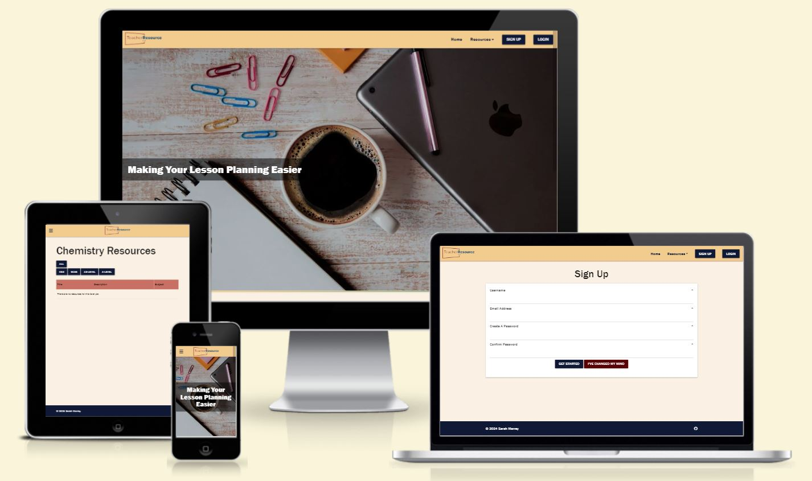

## Contents

- [User Experience (UX)](#user-experience-ux)
  - [Goals](#goals)
  - [Users](#users)
  - [New User Stories](#new-user-stories)
  - [Existing User Stories](#existing-user-stories)
- [Design](#design)
  - [Wireframes](#wireframes)
  - [Database](#database)
  - [Colour Scheme](#colour-scheme)
  - [Typography](#typography)
  - [Effects](#effects)
  - [Design Choices](#design-choices)
- [Features](#features)
  - [Existing Features](#existing-features)
  - [Future Features](#future-features)
- [Testing](#testing)
- [Technologies Used](#technologies-used)
  - [Main Languages](#main-languages)
  - [Frameworks, Libraries and Programs](#frameworks-libraries-and-programs)
- [Deployment](#deployment)
  - [PostgreSQL Database](#postgresql-database)
  - [Heroku Deployment](#heroku-deployment)
  - [Local Source Files](#local-source-files)
    - [Cloning](#cloning)
    - [Forking](#forking)
    - [Running Locally](#running-locally)
- [Credits](#credits)
  - [Content](#content)
  - [Images](#images)
  - [Acknowledgements](#acknowledgements)

## User Experience (UX)

### Goals

The aim of the site is to allow users to collaborate with each other by uploading and downloading resource and sharing opinions on them. 

- Users want to be able to intuitively navigate the site and receive immediate feedback when they interact with it. 
- Users want to be able to search through resources and view all relevant details of the them on the site. 
- Users want to be able to find all content they have uploaded themselves easily. 

### Users

Users will be educators looking for help with their lesson planning. They may also be looking to share their lesson resources. 

### New User Stories

As a first time user of the site I want to be able to:
- Find information about the website to see what it is used for.
- View resources before signing up to see if they look worth it.
- Easily and intuitively navigate without using browser buttons.
- Easily sign up using a simple form.
- Easily download a resource I like the look of once I have signed up. 

### Existing User Stories

As an existing user I want to be able to:
- Login to my account easily.
- Share my resources with other users using a simple form and view them.
- Edit or delete my uploaded resources easily.
- View other people's resources, filtering by subject or level, and download the resources I want to use.
- View comments to see what other users thought of resources before downloading.
- Provide feedback for other users on resources and edit or delete my comments easily. 
- Edit my details or delete my account.

## Design

### Wireframes

| Home Page | Sign Up | Profile | Subjects Pages |
| :---: | :---: | :---: | :---: |
| [Mobile](assets/images/wireframes/mobile-start.jpg) | [Mobile](assets/images/wireframes/mobile-game.jpg) | [Mobile](assets/images/wireframes/mobile-result.jpg) |
| [Tablet](assets/images/wireframes/tablet-start.jpg) | [Tablet](assets/images/wireframes/tablet-game.jpg) |[Tablet](assets/images/wireframes/tablet-result.jpg)|
| [Desktop](assets/images/wireframes/desktop-start.jpg) | [Desktop](assets/images/wireframes/desktop-game.jpg) | [Desktop](assets/images/wireframes/desktop-result.jpg) |

### Database 

I planned out the database before beginning the project with defined relationships. The site uses a relational database due to the ability to link tables together. 

### Colour Scheme

The site's colour scheme is based on the palette:


The colour palette was selected using the palette generator on [Coolors](coolors.co).
- Blue is associated with trust and intelligence, which is important so users feel they can trust the website and the resources are of high quality. 
- Yellow was chosen as it is associated with happiness, confidence and creativity. All of these are feelings users need to have when uploading their own work. 
- Red was chosen as a contrasting colour to the blue. 
- The off-white was added as a background to the body as the white was too harsh on the eyes and it's easier for people to read from, including those with Dyslexia for example.

I used a [contrast checker](https://webaim.org/resources/contrastchecker/) to ensure elements had a high enough contrast ratio. I ensured all elements had a high ratio. 

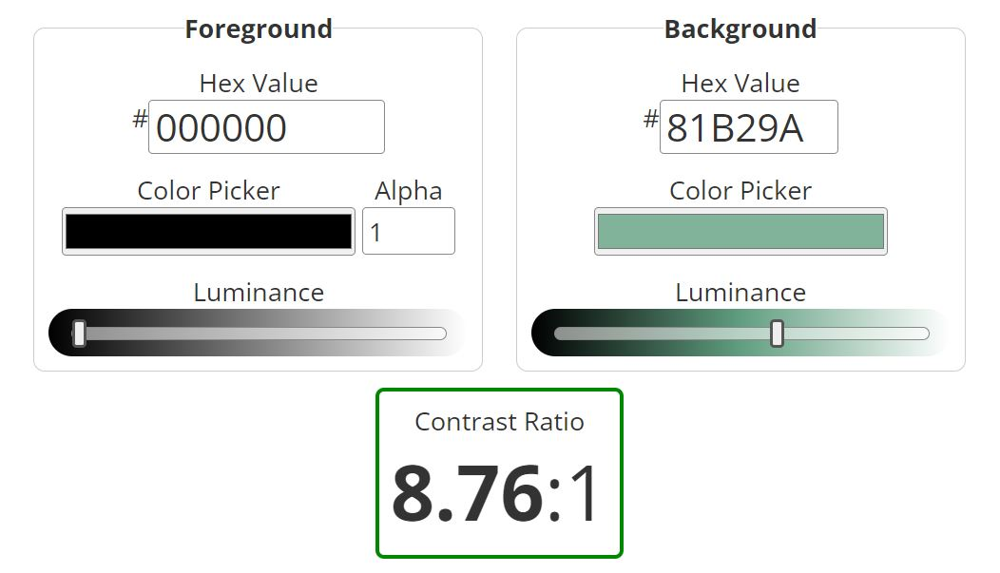

### Typography

The font Franklin Gothic was chosen for headers and buttons as it is a very clean sans-serif font that made everything clear on the site. It is a commonly used font on websites for this reason. When made bigger and bolder, it stands out against the thinner text so I didn't feel the need to use another font with it.

### Effects 

- When the mouse hovers over a button, the colour changes to a contrasting colour (blue to red) to make it clear to the user it can be clicked on. 
- The cursor changes to a pointer when it hovers over a button or a link to show you can click it.
- The navbar displayed different links when a user is logged to when a user is logged out. 


### Design choices

- The site is as consistent as possible across all screen sizes. 
- A small, fairly neutral, colour palette was used for consistency with blue and red added for pops of colour where needed. 
- All buttons/links are animated to make it clear that they could be selectable.
- The off-white background fits in with the colour palette and helps remove the harsh white background. This is particularly useful for people with reading difficulties. All forms have a white background to stand out from the background and help the text stand out. This wasn't as harsh as the full white background. 
- Cancel buttons are red so they stand out as warning in case users clicked on something by accident. 
- The navbar contains a dropdown for the different subjects to keep it minimal and allow easy navigation. 
- The hero image was chosen as the colours were consistent with the colour scheme. It also helps make the purpose of the website clear by containing items associated with working / planning lessons as a teacher.
- I wanted my hero image fairly bright to make the site welcoming. I added a transparent overlay to make it dark enough to read text over it as well as a dark transparent background to the text overlay itself so the text stands out and is readable. 
- The subject cards are on the index page as well as the navigation bar to encourage first time users to click on them and look through the different resources. 
- The resources were displayed as cards to start with. However, these looked messy as they were large and all different sizes. I decided to change them to a table to give a more consistent and clear layout. I made the whole row selectable so users could view more information easily without having to search for something to click. 
- The downlaod option is on the resources table for large screens. The table columns overlapped on smaller screens so I removed unneccessary details from the table. Users can still click to view the detailed resource information from the table. 


## Features

### Existing Features

<details>
<summary>Home Page</summary>

- The home page features a hero image with a text overlay to convey an immediate aim of the website - to help teachers plan lessons. The image was chosen to be bright and eye catching and is something all teachers can relate to. 
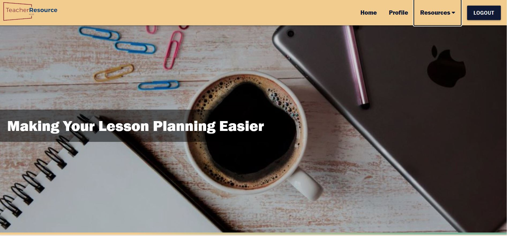

- It contains a promotion table, which is common on websites that explains the advantages of the using the website. This is responsive and becomes a column on smaller screens to stop the columns from becoming too thin. 
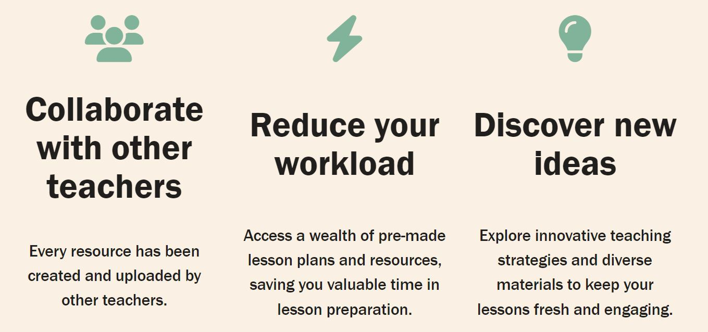
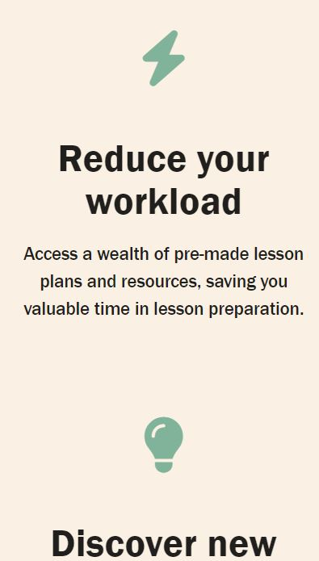

- The divider was created to clearly divide the home page into the 3 sections while adding a pop of colour. It was going to have a smaller width initially but it framed the bottom of the hero image nicely so I made it 100%. 
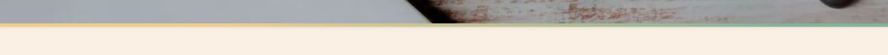

- There are cards at the bottom of the page linking to the resources for the 3 different subjects. These change colour when a mouse hovers over them so it's clear they are links. 
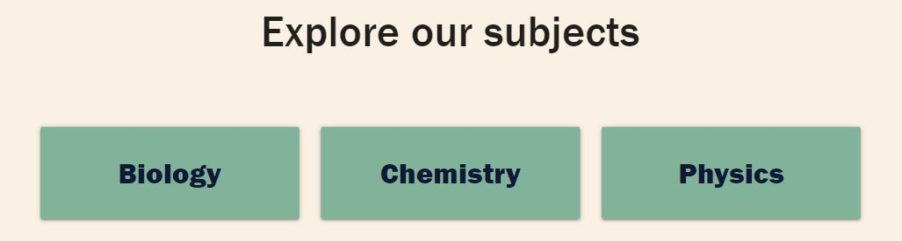
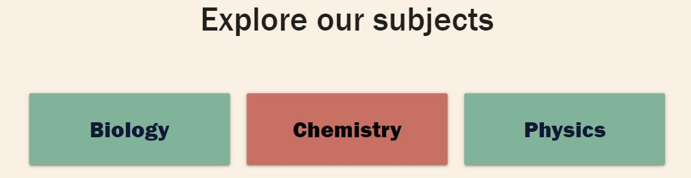

</details>

<details>
<summary>Navigation Bar</summary>

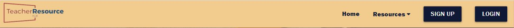

- The navigation bar is responsive and becomes a clickable icon on small screens to stop the buttons from becoming too crowded and overlapping each other. 

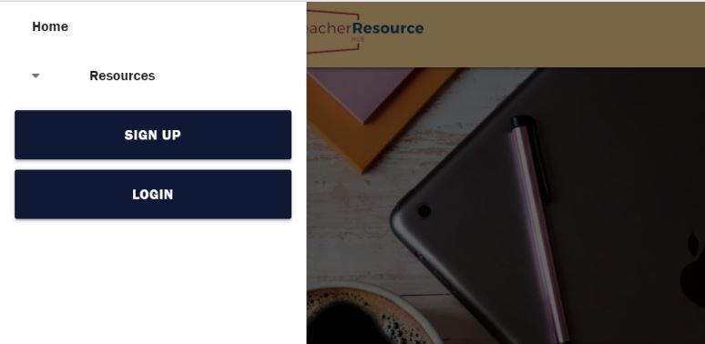

- The resources dropdown to keep the buttons very clear and users can jump to the page they want quickly. 
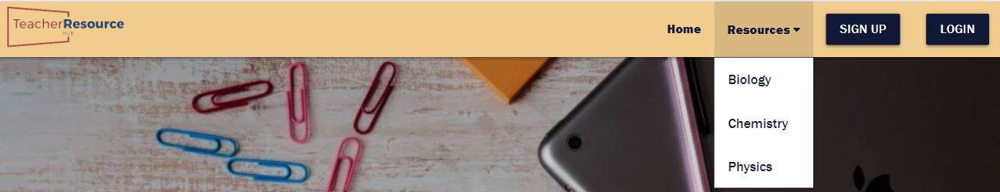

- The bar is sticky so it can be seen when a user scrolls down a page so navigation to another page is quick. 
- The links have a dark background when they are hovered over or selected as immediate user feedback. 


- The login, signup and logout buttons all change colour when they are hovered over. 
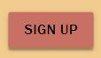

</details>

<details>
<summary>Footer</summary>


- The footer is a contrasting colour to the rest of the site. This is because it is fixed to the bottom of the page so it's not in the way, particularly on smaller screen sizes. Therefore I wanted it obvious when a user reached it. 
- There is a link to my github, which opens on a new tab as it isn't part of the site. The link subtly changes colour when the mouse hovers over it so user know it is a link. 
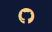

</details>

<details>
<summary>Sign Up Form</summary>

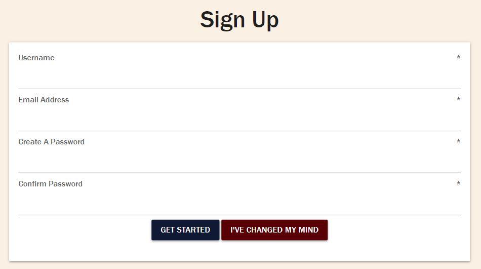

- The sign up form has clear labels above the inputs. There are stars on the right to show all the fields are required.
- The form has been styled as a card with a white background to stand out from the background and also make the grey text more readable. 
- The form has validation checks that include a user cannot be created if the username or email already exist in the database, or if the passwords entered do not match. 
- If an invalid form is submitted a message is flashed to the user explaining what went wrong. 
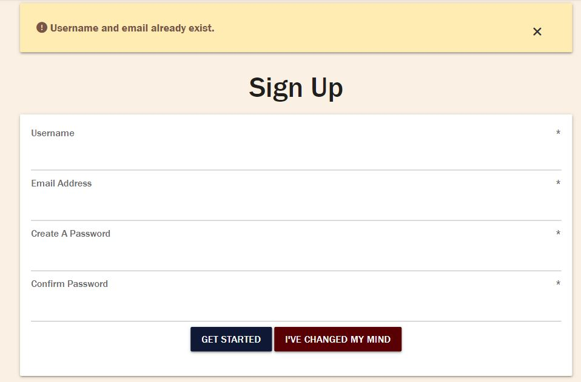
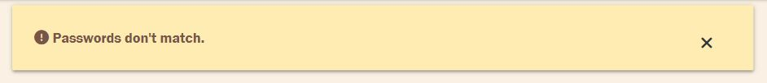

- The form contains a cancel button so the user can navigate back to the home page if they decide they don't want to sign up yet. 
- When a valid form is submitted, the user is logged in and directed to their profile. A success message is flashed to the user that they logged in. 

</details>

<details>
<summary>Login Form</summary>

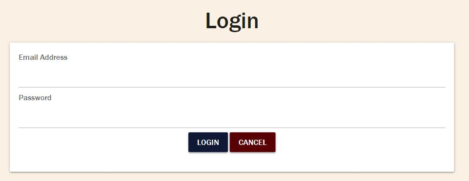

- The login form is styled to look the same as the sign up form for consistency. 
- The form checks values against the database and if the email doesn't exist or the password is incorrect, an error message is flashed to the user. 
- The user can click cancel to redirect to the home page if they decide not to log in. 
- If a valid form is submitted, users are directed to their profile and a success message is flashed to the user that they logged in. 

</details>

<details>
<summary>Profile</summary>

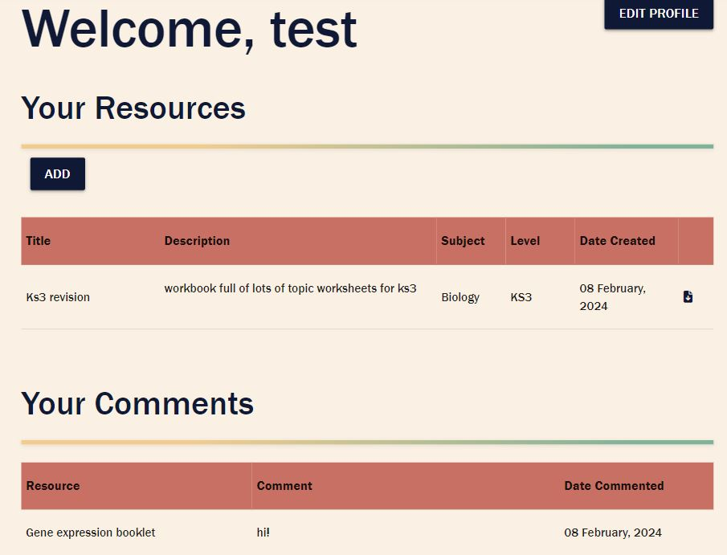
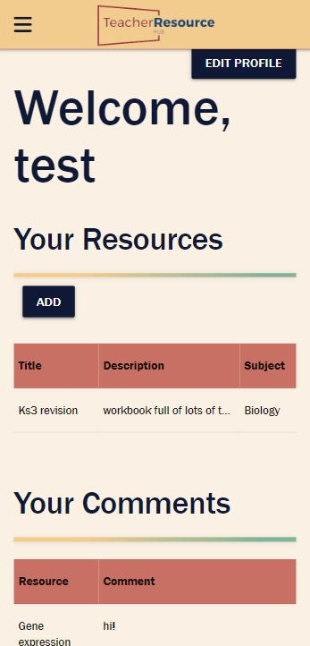

- The profile displays a welcome message to the user, displaying their username so it's evident who they are logged in as. 
- There is a button enabling users to edit their profile. This is at the top right, which is the position of a lot of edit buttons so users will instinctively look near the top of the screen. 
- Beneath the heading 'Your Resources' is a button to add a resource. It was placed here so it it clear to users they are adding a resource. 
- Beneath this button is a table displaying the resources uploaded by the user. This contains key information as well as a download button so users can download the file again if they want to. 
- There is a comments table so users can navigate to comments they have written in case they want to edit or delete a comment or see if another user has also commented on the same resource. Each row changes colour again and can be clicked on to open the resource the comment is on. 

</details>

<details>
<summary>Resource Table</summary>

- The table rows subtly change colour when the mouse hovers over them so show which row is selected, which makes it easier to read across the row and also shows that it can be clicked. The rows open up the detailed resource view for the resource clicked. 
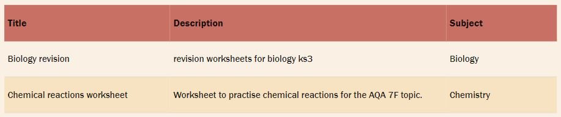

- The table is responsive where on a smaller screen, less important columns are removed so the columns don't overlap or become crowded. 

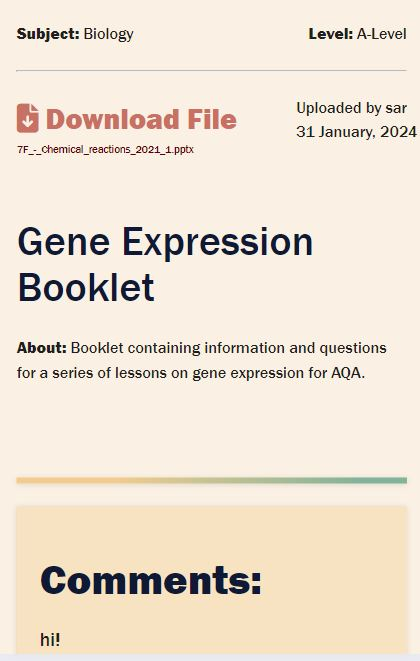

- The description has the potential to become very long so the column is truncated to prevent the decription from going over 1 line. This keeps the table smaller so more resources fit onto the screen and it looks neater. 
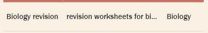

</details>

<details>
<summary>Edit Profile</summary>

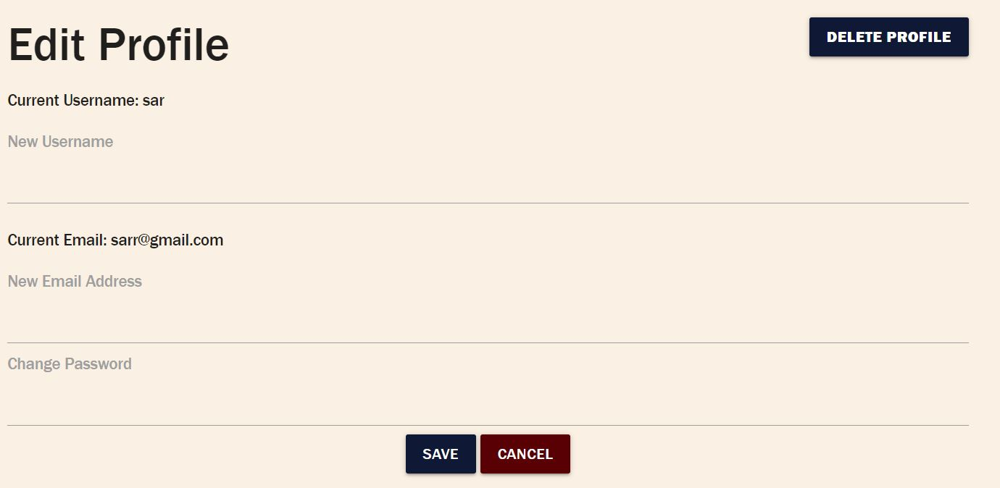

- The edit profile form displays the user's current username and email so they can see what details they already have uploaded. 
- The fields that are filled in will be changed and any fields left blank will stay as the existing details. 
- A user who tried to edit the profile of another user will not be authorized and the form will not be submitted. 
- This page also contains the delete profile button. It is on this page so it isn't encouraged by being on a main page, but it is on a page users will look. 
- If users fill in a field but then click cancel, they will be redirected back, the form will not be submitted and their details will stay the same. 
- Upon successful submission a message is flashed to users.
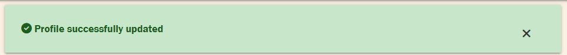

</details>

<details>
<summary>Delete Profile</summary>

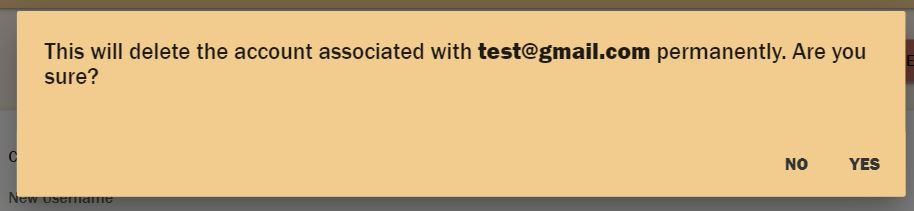

- The delete profile button opens up a modal. This is styled consistently with the webiste scheme. 
- If users click no or anywhere around the modal their profile will not be deleted. If they click yes, their profile will be removed from the database and they are redirected home with a flashed message informing the user deletion was successful. 

</details>

<details>
<summary>Add Resource</summary>

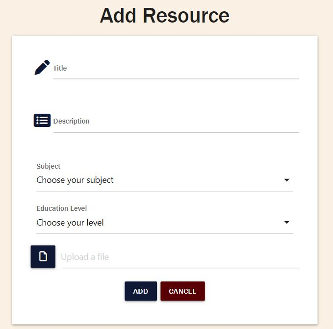

- The add resource form is clearly laid out. As there are only 3 subjects and 4 education levels, these can be selected in a dropdown menu. 
- If a form is submitted with empty fields a message appears above the submit button to the user. This was added instead of a flash to prevent the page from reloading and the user having to type out a potentially long description again. 
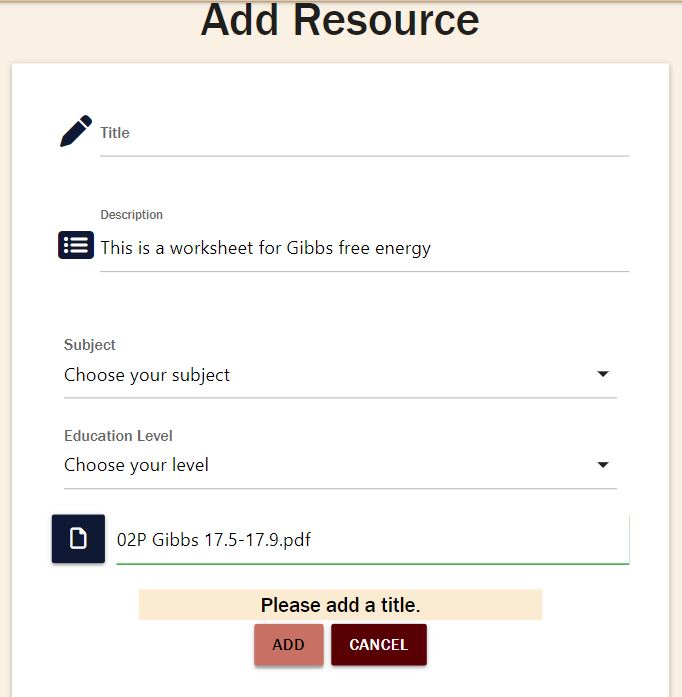

- Upon submission of a valid form, a resource is assigned to the user id and added to the database and the user will be redirected to their profile where the resource will be visible in the table.
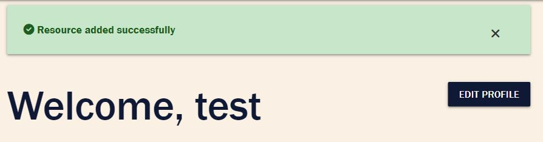

</details>

<details>
<summary>Edit Resource</summary>

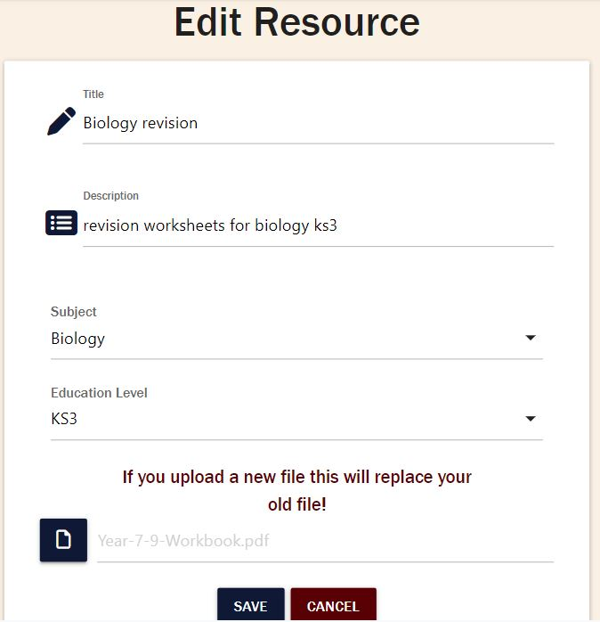

- The edit resource form is prepopulated with the existing data for that resource id so users don't need to remember existing data when editing. 
- Initially the filename wasn't present but it wasn't clear whether a file was currently uploaded or what the file was so the filename was added in. There is also a warning to users that uploading a new file will replace the existing file so they know they can't add another. 
- On submission if a field is blank the form won't submit and a message will appear. 
- If a user tries to delete a resource that isn't associated with their user id, a message will flash to say they are unauthorized and redirect them to the home page. 
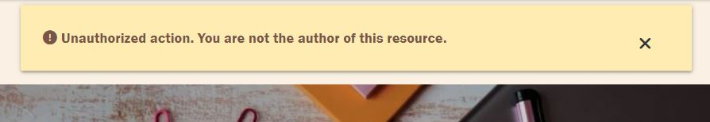

- If a valid form is submitted the resource data is updated and users are redirected to their profile where the change can be seen immediately. 
- The cancel button returns users back to the previous page. 

</details>

<details>
<summary>Delete Resource</summary>

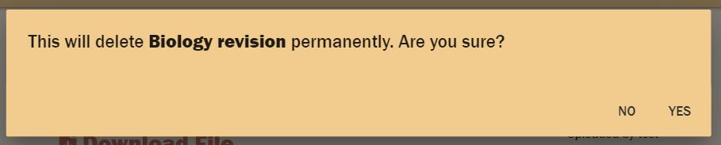

- The delete resource button opens a modal on the page. This ensures users purposefully clicked the button and lets them know it will be a permanent deletion. 
- If a user clicks no or anywhere around the modal it closes and it doesn't delete. If they click yes the resource is deleted and they are redirected to their profile, where the resource will no longer be seen with a flashed message informing the user deletion was successful. 

</details>

<details>
<summary>Subject Pages</summary>

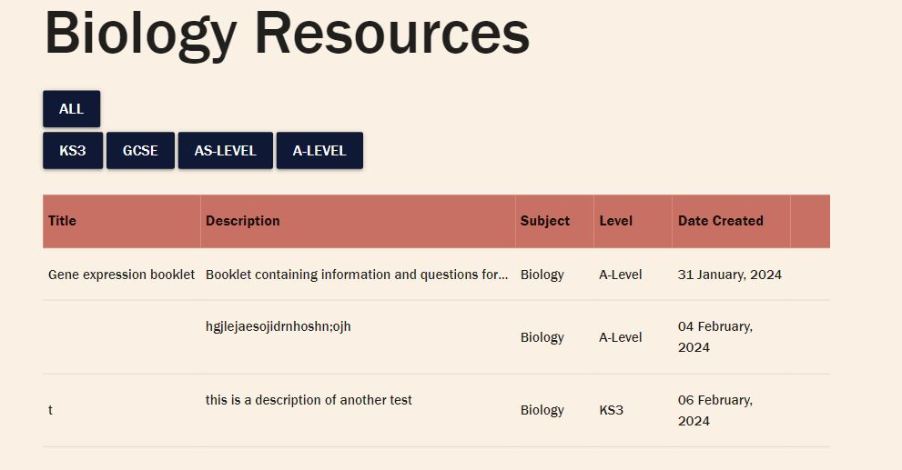

- There are three subject pages - biology, chemistry and physics - that show the resources uploaded for only those subjects.
- Resources are displayed on the resource tables as on the profile page for consistency. 
- There are buttons at the top that allow the user to filter the subject by education level too. On a small screen, one button fell below the others but it would take too much space putting the buttons into a column so the 'all' button was separated out and put above the others as a clear way for users to see how to remove the selected filter. 
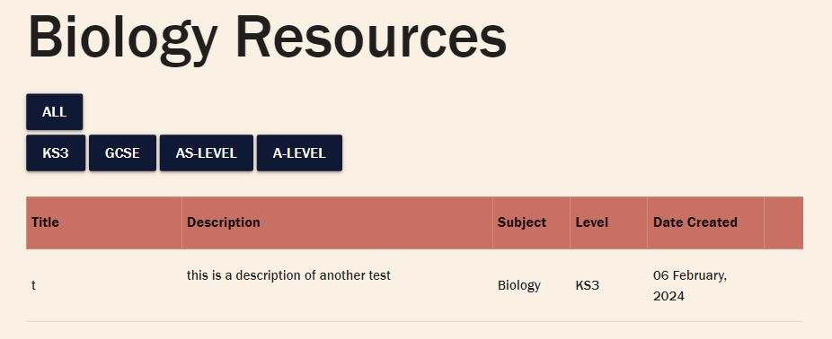

</details>

<details>
<summary>Detailed Resource View</summary>

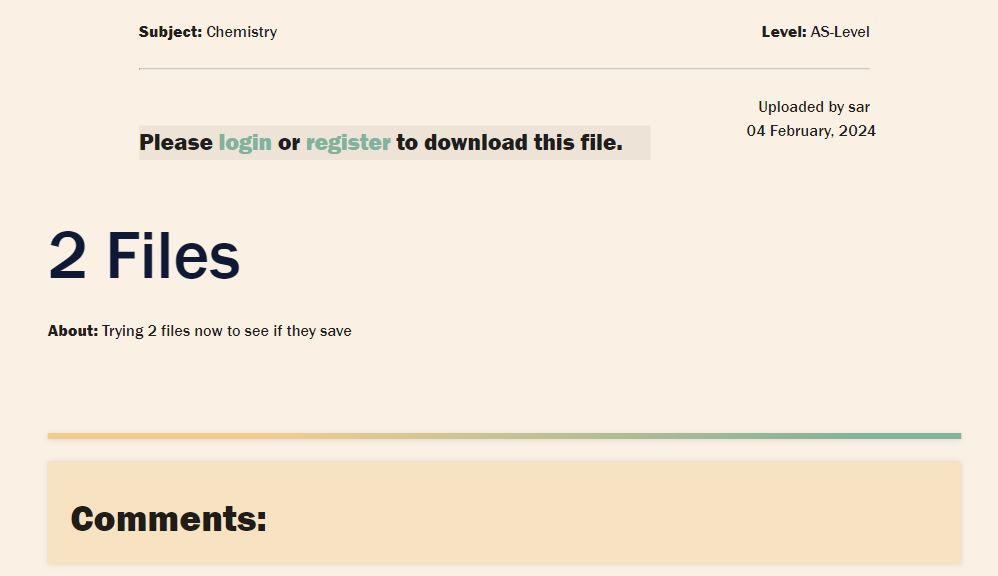

- At the top are the subject and education level. Below these are the download link and details of user and upload date. The download link includes the filename so users can see if it matches the title. They are separated by a line break to clearly separate the information and keep the important subject and level distinctly clear to find. 
- This section isn't as wide as the main section as a visual way to divide the sections as well as preventing the information from looking too far apart. 
- On a mobile, the top section is as wide as the rest of the page to stop the content being squashed together. 


- If a user is not logged in, the download option is not present and instead they are directed with links to the login and signup pages. These links change colour when the mouse hovers over them.


- If a user is logged in, the download button is present. This shows the name of the resource underneath. The text of the filename is small in case the filename is very long. It is also a slightly darker colour than the icon because the writing is so small. 
- When the download button is clicked, it downloads the resource onto the user's computer.
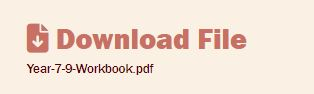

- Logged in users who created the resource also have edit and delete buttons below so they can edit or delete it. 
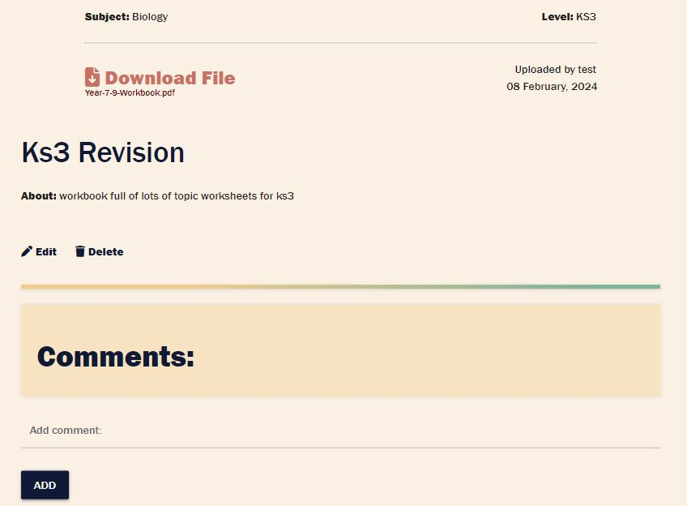

- The next section contains the title and description to show what has been uploaded. 
- The next section is the comments for the resource. The comments are visible to all users of the webiste. Logged in users who uploaded the comments will see an edit and delete icon by their comment so they can edit or delete it if they wish. 
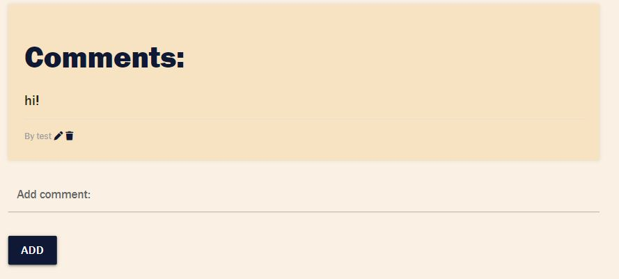
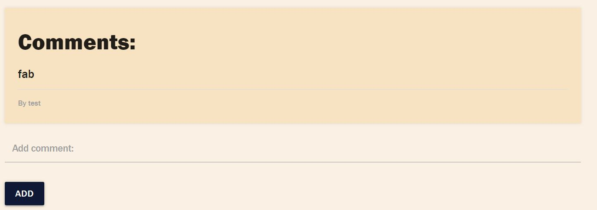

- The add comment form is directly below the comment box to allow users to quickly write and submit a comment without redirecting to a new page. 

</details>

<details>
<summary>Add Comment</summary>


- The form will not submit with an empty field and a message appears to the user for it to be filled in. 
- When a valid form is submitted the page will refresh and users will be able to see the comment in the comment box. 

</details>

<details>
<summary>Edit Comment</summary>

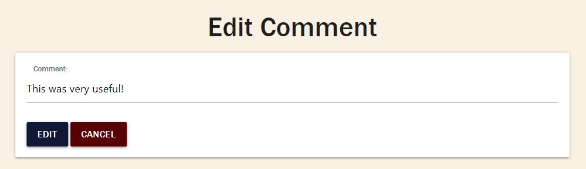

- The edit comment form is styled to look the same as all other forms for consistency. 
- The field is pre-populated with existing data from the comment id. 
- If a blank field is submitted the form will not be submitted and the user is prompted to complete it. 
- If a form is submitted from a user who did not create the comment, it will not be submitted and the user will be redirected home with a message flashed that they are not authorized.

</details>

<details>
<summary>Delete Comment</summary>

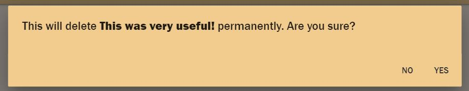

- When the delete button is clicked a modal opens to ensure the user wanted to delete the comment. 
- If a user clicks no or around the modal the modal closes. If yes is clicked the comment is deleted and the page is reloaded with a flashed message informing the user deletion was successful. 

</details>

<details>
<summary>Logout</summary>

- When a user clicks logout they are redirected to the login page as a convenient way to log back in in case logging out was an accident or they wanted to log in as a different user 

</details>

<details>
<summary>404 Page</summary>

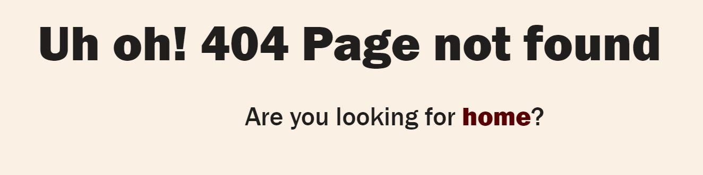

- I created a custom 404 page to maintain site-wide consistency when a page that doesn't exist is loaded. It contains the link to the home page as well as the navbar users can use to navigate. 

</details>

### Future Features

- Images of documents if more time to implement for all the types of documents that could be uploaded. 
- If more time I would add the ability to upload more than 1 file for each resource and be able to add or delete individual files from the resource.
- Add a love button to show users liked the resource without having to leave a comment. Resources could then be ordered by how liked they are.
- The ability to edit comments inline on the same page without being redirected to a new page after editing them. This would make the user experience much smoother. 
- Add pagination to tables so when there are lots of resources there won't be a very long page to scroll down. 

## Testing 

View the testing document [here](testing.md). 

## Technologies Used 

### Main Languages

HTML5, CSS3, Javascript, Python used. 

### Frameworks, Libraries and Programs

- Flask to provide Python framework.
- Jinja to help render templates. 
- PostgreSQL to create relational database and store user data.
- [Materialize](https://materializecss.com/) front-end framework for navbar, modals, tables, cards and alignment.
- Visual Studio Code as code editor. 
- GitHub Desktop to store the local repository and allow me to code using VS code. 
- [GitHub](https://github.com/) to store the repository online.
- [Font Awesome](https://fontawesome.com/) for icons.
- Chrome Dev Tools for debugging during development.
- Werkzeug to gennerate passwords in order to store them and to generate secure filenamesfor uploaded files.
- [Heroku](https://www.heroku.com) to deploy the live site.
- [ElephantSQL](https://www.elephantsql.com) to host my PostgreSQL database. 

## Deployment

### PostgreSQL Database

To set up the PostgreSQL database follow the steps: 
- Log into ElephantSQL 
- Click on 'Create New Instance'
- Type in the name of the plan (should be the project name)
- Select the plan required
- Click 'Select Region'
- Select data centre closest to you
- Click 'Review' and check through details
- Click 'Create instance' if everything is correct
- Click on the name of the instance created 

### Heroku Deployment

Follow the steps below to deploy the project on Heroku:
- Create a requirements.txt file in the root file directory using the command
` pip freeze --local > requirements.txt `. This will automatically fill with the requirements Heroku will need to install
- Create a Procfile in the root file directory and add the command 
```
web: python run.py
```
- Once these are added, log into Heroku and click 'New', 'Create new app'
- Create a name and the appropriate region and click 'Create app'
- Click on 'Settings' and 'Reveal Config Vars'
- Enter the relevant config variables
- Add a config variable named `DATABASE_URL` and copy in the database URL from ElephantSQL from the database created earlier 
- Navigate to 'Deploy' and connect to GitHub
- Select 'Enable Automatic Deploys' or manually deploy the site
- Once the site has been build, click 'More' and 'Run console'
- Type python3 and click 'Run'
- Import the database from the project onto ElephantSQL by typing into the console: 
```
from taskmanager import db
db.create_all()
```
- The site has now been successfully deployed

### Local Source Files

To access this GitHub repository locally, click on [this link](https://github.com/sarah2244-4/project-3-teacher-resource-hub) and either clone or fork it using the guidelines below. 

#### Cloning

- Open the [GitHub Repository](https://github.com/sarah2244-4/project-3-teacher-resource-hub) 
- In the repository click on the green '<> Code' dropdown
- Copy the HTTPS, SSH or GitHub CLI URL
- Open Git Shell or Terminal on the computer's IDE
- Change the current working directory to the 
- Type in `git clone` followed by the copied URL, for this project that would be 
```
git clone https://github.com/sarah2244-4/project-3-teacher-resource-hub
```
- Press enter and the clone will be successfully created

Cloning means that any edits made can be pushed and so make changes to the original repository. 

#### Forking 

- Open the [GitHub Repository](https://github.com/sarah2244-4/project-3-teacher-resource-hub) 
- In the repository click on the 'Fork' button just below the main bar
- A copy of the repository will now appear in your GitHub account

Any changes made to the forked respository will not affect the original respository in any way. 

#### Running Locally 

Once the respository has been cloned or forked, the relevant dependencies will need to be installed. 

- Open the IDE's Terminal and type 
```
pip3 install -r requirements.txt
```
- Create `env.py` within the root file directory and add this into the '.gitignore' file so it is not visible to others
- Within the `env.py` file, include the following:
```
import os

os.environ.setdefault("IP", "0.0.0.0")
os.environ.setdefault("PORT", "5000")
os.environ.setdefault("SECRET_KEY", "a_secret_key")
os.environ.setdefault("DEBUG", "True")
os.environ.setdefault("DEVELOPMENT", "True")
os.environ.setdefault("DB_URL", "postgreSQL database name")
```

## Credits

### Content

- I referred back to code I had previously written throughout the course, including the jest testing project to help with the automated Jest tests.
- [Am I Responsive?](https://ui.dev/amiresponsive) to display a mock-up of my site in different viewports.
- I used [Coolors](https://coolors.co/) to help me come up with a colour scheme.
- I used [WebAIM](https://webaim.org/resources/contrastchecker/) to check the contrast of the colours used on all the elements. 

### Images

- Hero image downloaded from [Pexels](https://www.pexels.com/photo/silver-ipad-545057/), which was free with no credit required.
- The site's favicon was generated at [favicon.io](https://favicon.io/favicon-generator/). 
- The logo was created with [LogoAI's logo maker](https://www.logoai.com/logo-maker).

### Acknowledgements

- Thank you to Code Institute for providing detailed lessons and walkthroughs.
- Thank you to the Code Institute community on Slack for providing advice and motivation.
- Thank you to my mentor Spencer for his invaluable advice and expertise.
