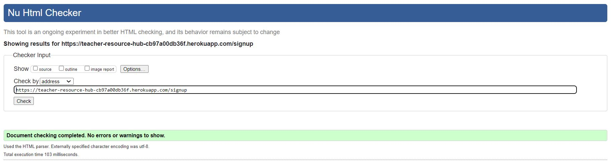
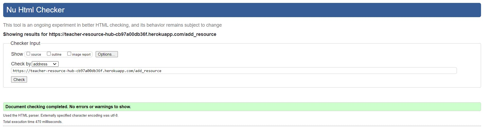
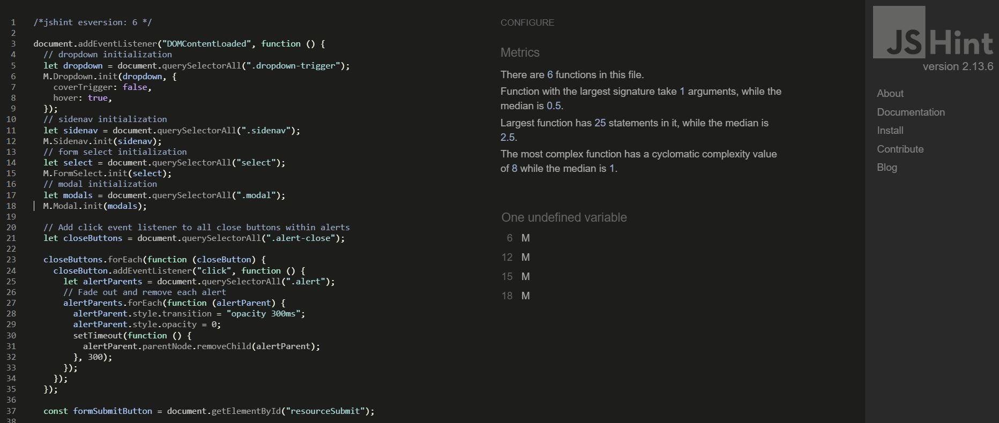

# Testing

## Contents

- [Manual Testing](#manual-testing)
    - [Responsivity](#responsivity)
    - [Browser Compatibility](#browser-compatibility)
    - [Functionality and Usability](#functionality-and-usability)
- [Testing User Stories](#testing-user-stories)
    - [New Users](#new-users)
    - [Existing Users](#existing-users)
- [Bugs](#bugs)
    - [Resolved Bugs](#resolved-bugs)
    - [Unresolved Bugs](#unresolved-bugs)
- [Validation](#validation)
    - [HTML Validation](#html-validation)
    - [CSS Validation](#css-validation)
    - [Javascript Validation](#javascript-validation)
    - [Python Validation](#python-validation)
    - [Lighthouse Testing](#lighthouse-testing)

## Manual Testing 

### Responsivity

| All pages | iPhone SE | Pixel 5 | Samsung Galazy S8+ | iPad Air | Surface Pro 7 | Nest Hub | Desktop |
| --- | :---: | :---: | :---: | :---: | :---: | :---: | :---: | 
| Responsive | Yes | Yes | Yes | Yes | Yes | Yes | Yes |
| All buttons change when hovered over | Yes | Yes | Yes | Yes | Yes | Yes | Yes |

### Browser Compatibility

| All pages | Chrome | Firefox | Edge | Opera |
| --- | :---: | :---: | :---: | :---: |
| Loads as expected | Yes | Yes | Yes | Yes |
| Responsive | Yes | Yes | Yes | Yes |

### Functionality and Usability

| User Action | Expected response | Correct Response |
| --- | --- | :---: |
| Type in website url | Loads home page | Yes | 
| Visit page that doesn't exist | Loads custom 404 error page | Yes |
| Click logo | Loads home page | Yes | 
| Click Home button in navbar | Loads home page | Yes |
| Hover over Resources button in nav bar | Dropdown menu appears | Yes |
| Click Biology button in navbar dropdown | Biology resources appear | Yes |
| Click Chemistry button in navbar dropdown | Chemistry resources appear | Yes |
| Click Physics button in navbar dropdown | Physics resources appear | Yes |
| Click Sign Up button in navbar dropdown | Sign up form appears | Yes |
| Click Sign Out button in navbar | User is logged out and redirected to home page | Yes |
| Use website without being logged in | Navbar displays home, resources, sign up and login buttons | Yes |
| Use website logged in as a user | Navbar displays home, profile, resources, and logout buttons | Yes |
| Click Login button in navbar dropdown | Login form appears | Yes |

#### Login and Sign Up Form Actions
| User Action | Expected response | Correct Response |
| --- | --- | :---: |
| Submit sign up form with a field missing | Form does not submit and user is promtped to fill in required field | Yes |
| Submit sign up form with existing username or email | Form does not submit and message is flashed to say they already exist | Yes |
| Submit sign up form with passwords that don't match | Form does not submit and message is flashed to say passwords should match | Yes |
| Submit valid sign up form | New user is created and profile page is loaded | Yes |
| Submit login form with incorrect email | Form does not submit and message flashed that email does not exist | Yes |
| Submit login form with incorrect password | Form does not submit and message flashed that password is incorrect | Yes |
| Submit valid login form | Profile page loads and message flashed to say login is successful | Yes |

#### Profile Actions
| User Action | Expected response | Correct Response |
| --- | --- | :---: |
| Click Edit Profile button on profile | Edit profile form appears | Yes |
| Submit edit profile form with existing username or email | Form does not submit and message is flashed to say they already exist | Yes |
| Submit valid edit profile form | Form is submitted and user is redirected to profile | Yes |
| Click delete profile | Modal pops up | Yes |
| Click no on modal or space around delete profile modal | Modal disappears and nothing is deleted | Yes |
| Click yes on delete profile modal | Profile is deleted and user is logged off and redirected to home | Yes |
| Log in using deleted profile credentials | Form does not submit and message is flashed to say email does not exist | Yes |

#### Resource Actions
| User Action | Expected response | Correct Response |
| --- | --- | :---: |
| Click add on profile to add resource | Add resource form appears | Yes |
| Submit add resource form with missing field | Message appears above submit button to direct user which field to complete | Yes |
| Submit valid add resource form | Form is submitted and user redirected to profile with flashed message to say successful | Yes |
| Submit valid add resource form | New resource is displayed in the profile resource table | Yes |
| Submit valid add resource form | New resource is displayed in the table of the relevant subject page | Yes |
| Click download icon on resource in table | File is downloaded to user's computer | Yes |
| Click on resource row in table | Large resource view appears | Yes |
| View resource as logged in user | Download file button appears and downloades file to user's computer if clicked | Yes | 
| View resource as guest user | Download file button is not present and user is directed to the login or signup page to download | Yes |
| View resource as user who created it | Edit and delete buttons are visible | Yes |
| View resource as user who did not create it | Edit and delete buttons are not visible | Yes |
| View resource as logged in user | Add comment button is visible | Yes |
| View resource as guest user | Add comment button is not visible | Yes | 
| Click edit resource button on resource view | Edit resource form appears | Yes |
| Submit edit resource form if not resource creator | Form does not submit and user redirected to home with flashed message | Yes | 
| Submit edit resource form with blank field | Form does not submit and user directed to complete missing field | Yes |
| Submit valid edit resource form | Form submits and user redirected to previous view page | Yes |
| Click delete button to delete resource | Modal pops up | Yes |
| Click no on delete resource modal or space around modal | Modal disappears and nothing is deleted | Yes |
| Click yes on delete resource modal | Resource is deleted and removed from resource table | Yes |

#### Comment Actions
| User Action | Expected response | Correct Response |
| --- | --- | :---: |
| Click add button to add comment with blank field | Form not submitted and user directed to fill in field | Yes |
| Click add button to add commment with valid form | Form submitted and page reloaded with comment visible | Yes |
| Click edit icon on comment | Edit comment form appears | Yes |
| Click edit on edit comment form as user who created comment | Form submitted and user redirected to profile | Yes |
| Click edit on edit comment form as user who did not create comment | Form not submitted and profile loads with message flashed | Yes |
| Click cancel button on comment form | Profile page loads | Yes |
| Click delete icon on comment | Delete comment modal pops up | Yes |
| Click no on modal or space around delete comment modal | Modal disappears and nothing is deleted | Yes |
| Click yes on delete comment modal | Comment is deleted, page refreshes and comment is no longer displayed | Yes |

#### Subject Page Actions
| User Action | Expected response | Correct Response |
| --- | --- | :---: |
| Click all button on biology resources | All biology resources are shown in the table | Yes | 
| Click KS3 button on biology resources | Only KS3 biology resources are shown in the table | Yes | 
| Click GCSE button on biology resources | Only GCSE biology resources are shown in the table | Yes | 
| Click AS-Level button on biology resources | Only AS-Level biology resources are shown in the table | Yes | 
| Click A-Level button on biology resources | Only A-Level biology resources are shown in the table | Yes | 
| Click all button on chemistry resources | All chemistry resources are shown in the table | Yes | 
| Click KS3 button on chemistry resources | Only KS3 chemistry resources are shown in the table | Yes | 
| Click GCSE button on chemistry resources | Only GCSE chemistry resources are shown in the table | Yes | 
| Click AS-Level button on chemistry resources | Only AS-Level chemistry resources are shown in the table | Yes | 
| Click A-Level button on chemistry resources | Only A-Level chemistry resources are shown in the table | Yes | 
| Click all button on physics resources | All physics resources are shown in the table | Yes | 
| Click KS3 button on physics resources | Only KS3 physicsy resources are shown in the table | Yes | 
| Click GCSE button on physics resources | Only GCSE physics resources are shown in the table | Yes | 
| Click AS-Level button on physics resources | Only AS-Level physics resources are shown in the table | Yes | 
| Click A-Level button on physics resources | Only A-Level physics resources are shown in the table | Yes | 
| View subject pages as guest user | Download icon not visible | Yes |
| View subject pages as authorized user | Download icon is visible | Yes |
| Click on row in tables | Loads resource view | Yes |

## Testing User Stories

### New Users

| Goal | Result | Image |
| --- | --- | :---: |
| Find information about the website to see what it is used for. | The hero text on the index page displays a line explaining the aim of the website straight away. There is a promotion table beneath this explaining why users should use the webiste. | [Hero image](resourcehub/static/assets/images/readme/hero.JPG) [Promo table](resourcehub/static/assets/images/readme/promo-table.JPG) |
| View resources before signing up to see if they look worth it. | The index page has large cards as links to the different subject pages. Guest users can view titles and descriptions of all resources without logging in. The navbar also contains a dropdown for the different subjects so the resources can be found from any page. | [Subject cards](resourcehub/static/assets/images/readme/subject-cards.JPG) [Navigation dropdown](resourcehub/static/assets/images/readme/navigation-dropdown.JPG) |
| Easily and intuitively navigate without using browser buttons. | The navbar is present on every page. Forms contain cancel buttons to allow users to redirect to the previous page if they no longer wish to submit the form. | [Navigation](resourcehub/static/assets/images/readme/navigation-bar.JPG) |
| Easily sign up using a simple form. | The sign up form contains 4 clearly labelled fields with stars that show they are required. If the form is invalid a message is flashed to user explaining what went wrong. | [Sign up form](resourcehub/static/assets/images/readme/signup-form.JPG) [Flashed message](resourcehub/static/assets/images/readme/signup-flashed-message.JPG) | 
| Easily download a resource I like the look of once I have signed up. | Files can be downloaded from the icon in the tables on the subject pages on a large screen or on the detailed resource view. It is made clear at the top above the title in a different colour and large font. | [Download button](resourcehub/static/assets/images/readme/download-link.JPG) [Resource table](resourcehub/static/assets/images/readme/subject-table-logged-in.JPG) | 

### Existing Users

| Goal | Result | Image |
| --- | --- | :---: |
| Login to my account easily. | Navbar clearly displays login button and form is very simple. If details are invalid, form returns flashed message explaining why. | [Navbar buttons](resourcehub/static/assets/images/readme/side-navbar.JPG) [Login form](resourcehub/static/assets/images/readme/login-form.JPG) | 
| Share my resources with other users using a simple form and view them. | An add button is under the title 'Your resources' on the profile page. A simple form is loaded and clearly labelled with what should be included. If an invalid is submitted messages are displayed above the submit button explaining why. On the profile page a table shows user-created resources. Each row can be clicked to load a detailed resource view. | [Profile page](resourcehub/static/assets/images/readme/profile.JPG) [Add resource form](resourcehub/static/assets/images/readme/add-resource.JPG) [Resource table](resourcehub/static/assets/images/readme/subject-table-logged-in.JPG) | 
| Edit or delete my uploaded resources easily. | The profile contains a table of user-created resources. The rows can be clicked to display the detailed resource view. There are clearly labelled edit and delete icons. The edit form is pre-filled in with existing information to make it easy to remember what needs changing. The delete button opens a modal for user to confirm deletion. | [Detailed resource view](resourcehub/static/assets/images/readme/resource-view-user.JPG) [Edit resource form](resourcehub/static/assets/images/readme/edit-resource.JPG) [Delete resource modal](resourcehub/static/assets/images/readme/delete-resource.JPG) | 
| View other people's resources, filtering by subject or level, and download the resources I want to use. | The subject pages contain all resources uploaded for that subject. Each subject has filters for each level to filter the resources. If there are no resources a message appears informing the user there aren't any rather than an empty table so users don't think there was an error. On a large screen the download icon is present and it can be downloaded straight away. Otherwise the row can be clicked to open the detailed resource view and there is a clear download button in a different colour at the top of the page. | [Subject page](resourcehub/static/assets/images/readme/subject-page-not-logged-in.JPG) [Filtered subject table](resourcehub/static/assets/images/readme/subject-table-filtered.JPG) [Download button](resourcehub/static/assets/images/readme/download-link.JPG) | 
| View comments to see what other users thought of resources before downloading. | The detailed resource view page has comments displayed at the bottom of the page. | [Comments](resourcehub/static/assets/images/readme/comments-not-user.JPG) | 
| Provide feedback for other users on resources and edit or delete my comments easily. | Comments can be added on the detailed resource page. The form is on the same page and the page is reloaded once it has been submitted so users can immediately view their comment. The user can view an edit and delete button next to their comments and they lead to a simple edit form and a delete modal for user to confirm deletion. | [Comments as a user](resourcehub/static/assets/images/readme/comments-logged-in-user.JPG) [Edit comment form](resourcehub/static/assets/images/readme/edit-comment.JPG) [Delete comment modal](resourcehub/static/assets/images/readme/delete-comment.JPG) | 
| Edit my details or delete my account. | On the user profile there is an edit profile at the top of the page. This leads to a simple form where the current username and email are displayed, allowing users to decide whether anything needs changing. This page also displays the delete profile button, which opens a modal for user to confirm deletion. | [Edit profile form](resourcehub/static/assets/images/readme/edit-profile.JPG) [Delete profile modal](resourcehub/static/assets/images/readme/delete-profile.JPG) | 

## Bugs

### Resolved Bugs

- The rows of the table overlapped on smaller screens. Without adding horizontal scroll bars or making text too small to read, I created tables with fewer columns to display on smaller screens. Most vital information was shown as the rest can still be accessed when the row is clicked. 
- Comments were added to the same row of the comment table on the profile if more than one comment was added to the same resource. To fix this, I had to move for loop outside the table row. 
- Alerts wouldn't close when the close button was clicked. The fix was to add javascript to add an event listener to close the alert when the button is clicked. 

### Unresolved Bugs

- The upload file button can be accidentally clicked from around the two dropdown fields above. Chrome Dev Tools showed they overlap but it was to do with Materialize styling. I tried to move field lower and change styling of form but it didn't fix this. 
- The mobile side navbar buttons change to the default Materialize colour when they are selected. I tried overriding this with different classes and styles but it hasn't been fixed.

## Validation

### HTML Validation

I used the [W3 Validator](https://validator.w3.org/) to validate my HTML files. I did this by pasting in the URI for each page of my depolyed site. 

Initial issues were: 

- Inputs had a slash before the closing tags. 
- A page contained a duplicate `
`. 

After fixing these each page passes the validator with no issues: 

Index

Sign Up

Login

Profile

Edit Profile

Add Resource

Edit Resource

View Resource

Subject Pages

Edit Comment

### CSS Validation

I used the [W3 Validator](https://validator.w3.org/) to validate my styles.css file. 

### Javascript Validation

I used [JSHint](https://jshint.com/) to validate my script.js file. 

The only message is one undefined variable but this was needed to initialize the Materialize elements so I was able to ignore it. 

### Python Validation

I used the [Code Institute Python Linter](https://pep8ci.herokuapp.com/) to validate my python files. 

The initial results that came up were whitespaces at the ends of lines and some lines were too long. 

After fixing these, there were no errors. 

### Lighthouse Testing

I used lighthouse in Chrome Dev Tools to test for performance, accessibility, best practises and SEO for each page. 

Initial lighthouse testing showed:
- Kaspersky was trying to load links that didn't work on my browser. There was no extension for it on chrome so to resolve this I had to uninstall the program.
- I needed to add aria-labels to two of the links on base.html for accessibility. 
- To optimise the hero image I changed it to a .webp file format.
- I needed to add width and height values to the logo. 

Final results can be seen here: 

Index Page

Register

Login

Profile

Edit Profile

Add Resource

Edit Resource

Subject Page

View Resource

Edit Comment

### Return to [README](README.md).